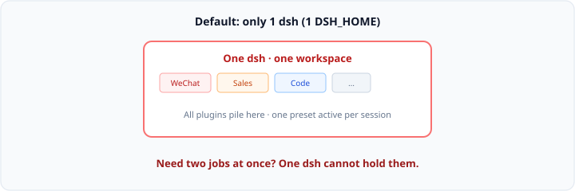
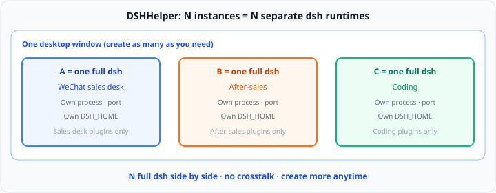

# DSHHelper — Unlimited dsh instances on one desktop

[中文](README.md) · [User Guide](docs/user-guide.en.md) · [Releases](https://github.com/x102201/deepseek-harness-helper/releases)

**One desktop window. As many isolated DeepSeek Harness runtimes as you need. Each instance = a full, separate dsh.**

<video controls autoplay muted loop playsinline poster="docs/assets/en/screenshot-main-light.png" width="720">
  <source src="docs/assets/video/dsh-helper-demo.mp4" type="video/mp4" />
</video>

[▶ Watch demo (if autoplay is blocked)](docs/assets/video/dsh-helper-demo.mp4)

---

## 1. For yourself: one dsh cannot hold two jobs → one instance = one dsh

### Pain

| You want | Reality |
|----------|---------|
| WeChat sales desk + after-sales + coding **at once** | Default is **one** workspace (one `DSH_HOME`) |
| Each job keeps its own plugins | Everything piles into one home → tool bloat → AI picks wrong tools → **worse as you add more** |
| Switch capability with Agent presets | **One preset per session**; switch after a turn is locked |

Sources: [Agent presets](https://deepseekdocs.com/en/docs/features/persona) · [design note](https://github.com/deepseek-ai/deepseek-harness/blob/master/.agents/notes/implemented/architecture/2026-08-03-per-session-agent-presets.md)

**Parallel directed work needs parallel dsh — not one overloaded home.**

### Fix

DSHHelper runs many instances in one window.  
**An instance is not a tab. Instance = own process + own port + own `DSH_HOME` = a complete dsh.**

WeChat sales on the left, after-sales on the right, coding below — three dsh runtimes side by side, plugins never mix.

---

## 2. For selling: days to make it work — then you still cannot ship or scale

You spent days getting WeChat auto sales talk working — plugins, presets, scripts, flow tuned piece by piece.

Then someone wants to buy it. What breaks is not “can they use it”, but that **every sale feels like rebuilding the project**:

1. **Cannot reproduce** — days later even you cannot say which plugins and which preset are “the product”; install for a customer drifts, another few days gone  
2. **Cannot hand off** — a README never installs cleanly; shipping the folder invites piracy / resale  
3. **Cannot sell to many** — customer two and three need the same remote grind; **delivery time dwarfs the time you spent building**, so you cannot scale sales

**`.dshpack`:** export that one tuned sales instance (one full dsh) as a file. They import and run. Bind machine code / password; forbid re-export — you sell a finished product, not install labor.

---

## User guide

1. [Concepts](docs/user-guide.en.md#concepts)
2. [Install](docs/user-guide.en.md#install)
3. [First run](docs/user-guide.en.md#first-run)
4. [Workspaces](docs/user-guide.en.md#workspaces)
5. [Packages (.dshpack)](docs/user-guide.en.md#packages-dshpack)
6. [Data, migrate, uninstall](docs/user-guide.en.md#data-migrate-uninstall)
7. [Settings reference](docs/user-guide.en.md#settings-reference)
8. [Troubleshooting](docs/user-guide.en.md#troubleshooting)
