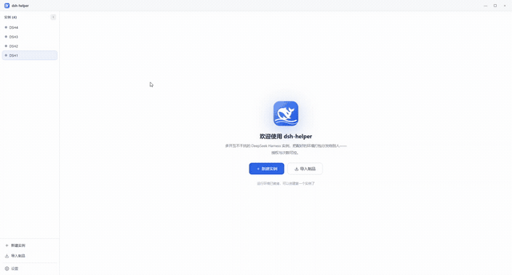
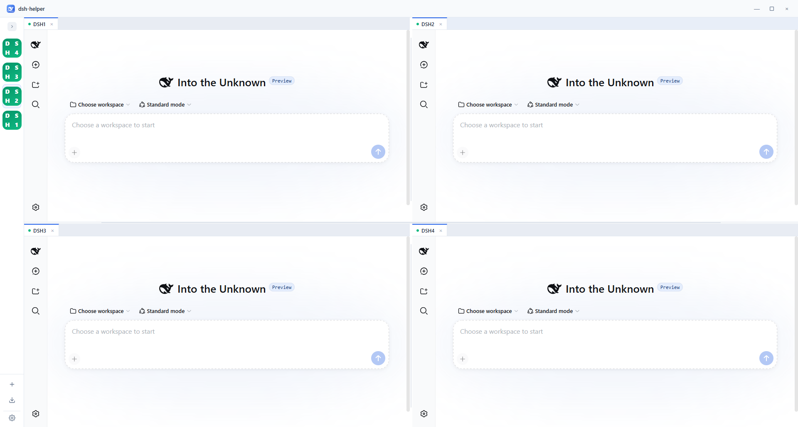
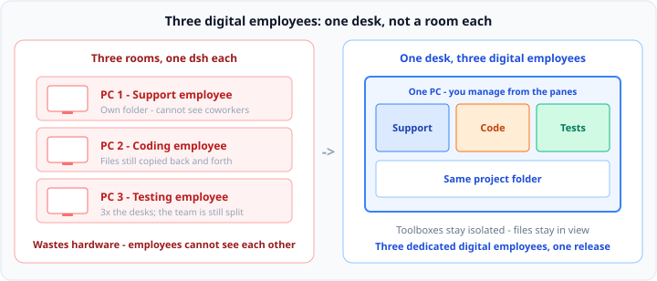
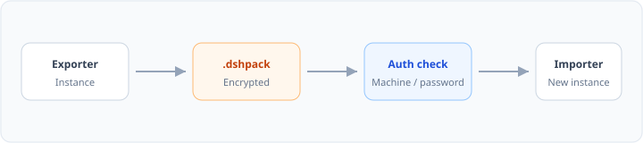

# DSHHelper — Unlimited dsh instances on one desktop

[中文](README.md) · [User Guide](docs/user-guide.en.md) · [Releases](https://github.com/x102201/deepseek-harness-helper/releases)

[Download full demo (mp4)](docs/assets/video/dsh-helper-demo.mp4)

I keep several jobs running at once. Out of the box you get one dsh; stuffing them together makes it worse the more you add — so I built this:
**One desktop window. As many isolated DeepSeek Harness runtimes as you need. Each instance = a full, separate dsh.**

---

## 1. Isolate: one dsh cannot hold two jobs

### Pain

I run three lines in parallel: customer messages, code, and tests plus reports.

Default is one dsh (one `DSH_HOME`). Pile every plugin into the same workspace and the tool list grows until the model starts picking the wrong tools — not because I cannot configure, but because three unrelated capability sets do not fit in one preset. **Structurally, it does not fit.**

Agent presets do not save you: **only one mounts per session**, and switching after a turn is locked.

> Per DeepSeek Harness: [*Agent Presets and Personas*](https://deepseekdocs.com/en/docs/features/persona) · [architecture note *A session's agent is composed from a preset*](https://github.com/deepseek-ai/deepseek-harness/blob/master/.agents/notes/implemented/architecture/2026-08-03-per-session-agent-presets.md)

### Fix

Stop forcing everything into one dsh.
**Each instance = one full, separate dsh** (own process, port, and `DSH_HOME`) — not a tab inside a single runtime.

Support on the left, coding on the right, tests below — open as many as you need; plugins never mix.

> Isolation is clean, and working alone is easy. Real work is not three non-intersecting lines —
> that customer message still has to reach the developer. That is section 2.

---

## 2. Collaborate: three dedicated digital employees, one desk

**Each dsh is a dedicated digital employee:** support only takes the desk, coding only touches the repo, testing only runs the checklist. Plugins are their toolbox, so they must be split — that was section 1.

But the three of them still ship the same job. Parking each on a separate computer is three private offices: you burn three machines, still copy files around, and still cannot see the whole board. **Digital employees need adjacent desks, not a room each.**

Sit them on one machine: **three instances share one project directory**; toolboxes stay apart, files are shared. You dispatch from the split panes — change a chunk on the left, update the same files on the right, check the list below.

This is not three unrelated windows side by side. It is three digital employees at one desk grinding **the same release**.

They do not pass messages to each other today. Dispatch is still you.

---

## 3. Sell: tune several roles, export several packs

It took days to get the support, coding, and testing digital employees running together — plugins, presets, scripts, who watches whom, tuned piece by piece.

Then someone wants to buy. What breaks is not “can they use it”, but that **every sale feels like rebuilding the project**:

1. **Cannot reproduce** — days later even you cannot say which plugins and which preset are “the product”; install for a customer drifts, another few days gone
2. **Cannot hand off** — a README never installs cleanly; shipping the folder invites piracy / resale
3. **Cannot sell to many** — customer two and three need the same remote grind; **delivery time dwarfs the time you spent building**, so you cannot scale sales

**`.dshpack`:** export that one trained digital employee (one full dsh) as a file. They import and run. Bind machine code / password; forbid re-export — you sell a finished product, not install labor.

Tune several digital employees, export several packs. One `.dshpack` is still one dsh; after import it shows up in the sidebar — they drag the split layout themselves.

---

## User guide

1. [Concepts](docs/user-guide.en.md#concepts)
2. [Install](docs/user-guide.en.md#install)
3. [First run](docs/user-guide.en.md#first-run)
4. [Workspaces](docs/user-guide.en.md#workspaces)
5. [Packages (.dshpack)](docs/user-guide.en.md#packages-dshpack)
6. [Data, migrate, uninstall](docs/user-guide.en.md#data-migrate-uninstall)
7. [Settings reference](docs/user-guide.en.md#settings-reference)
8. [Troubleshooting](docs/user-guide.en.md#troubleshooting)
