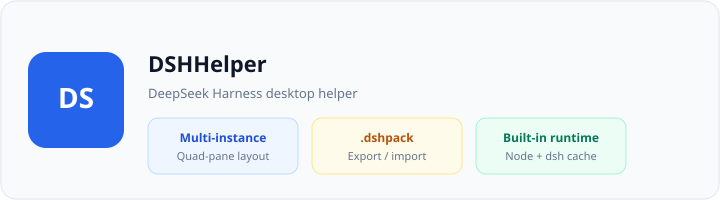
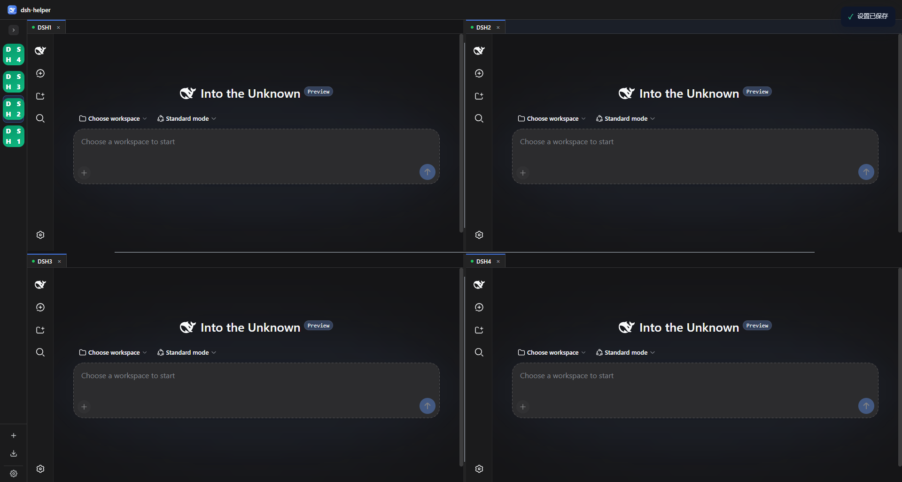

# DSHHelper — DeepSeek Harness Desktop Helper

[中文](README.zh-CN.md) · [User Guide (EN)](docs/user-guide.en.md) · [用户指南 (ZH)](docs/user-guide.zh-CN.md)

**DSHHelper** is a desktop app for running **multiple isolated DeepSeek Harness (dsh) workspaces** on one machine. It ships a built-in Node.js + dsh runtime, supports **quad-pane layouts**, and lets you **export / import** configured environments as `.dshpack` packages.

> This repository contains **documentation and release installers only** — no application source code.

## Download

Installers are published on **[GitHub Releases](https://github.com/x102201/deepseek-harness-helper/releases)**.

| Platform | File name pattern |
|----------|-------------------|
| Windows x64 | `DSHHelper_{version}_windows_x64-setup.exe` |
| Windows arm64 | `DSHHelper_{version}_windows_arm64-setup.exe` |
| macOS | `DSHHelper_{version}_macos_{arch}.dmg` |
| Linux | `DSHHelper_{version}_linux_{arch}.deb` · `.AppImage` |

Version numbers match the installer file name. See [Releases](https://github.com/x102201/deepseek-harness-helper/releases) for the latest build.

## Highlights

- **Multi-instance** — several dsh environments side by side; drag tabs to split into a 2×2 grid
- **Built-in runtime** — Node + dsh cached under your data folder (default `%USERPROFILE%\.dshHelper` on Windows)
- **`.dshpack` packages** — share presets, patches, and settings with optional machine / password protection
- **Light & dark shell** — Settings → General → Appearance (affects the helper UI only, not pages inside instances)

## Quick start

1. Install from Releases and launch **DSHHelper**
2. Follow the first-run wizard (data directory → runtime → create first instance)
3. Create more instances from the sidebar; open several in a quad-pane layout

Full walkthrough: **[docs/user-guide.en.md](docs/user-guide.en.md)**

## Data directory

All environments, cache, imports, settings, and logs live under one folder (default: `~/.dshHelper` or `%USERPROFILE%\.dshHelper`). You can change it in **Settings → General**.

## Feedback

- [GitHub Issues](https://github.com/x102201/deepseek-harness-helper/issues)
- In-app: **Settings → About → Feedback**

## License & notice

Installers are distributed via this repository’s Releases. Usage statistics are collected anonymously to improve the product (duration and aggregate counts only; no paths or instance names).
