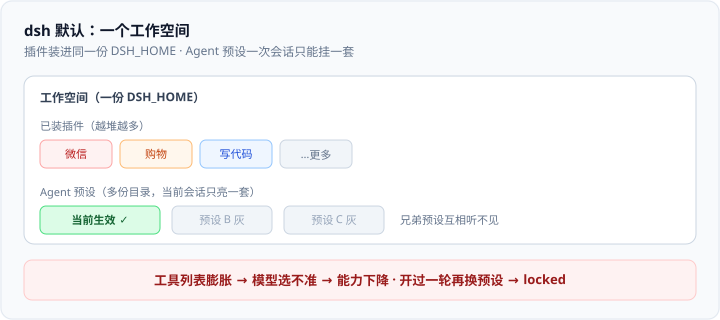
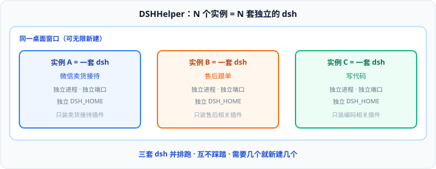

# DSHHelper — 一任务一实例的 DeepSeek Harness 桌面助手

[English](README.en.md) · [用户指南](docs/user-guide.zh-CN.md) · [Releases](https://github.com/x102201/deepseek-harness-helper/releases)

**每个定向任务一个实例，每个实例只留固定插件集合；需要并行就并排开。**

<video controls poster="docs/assets/zh-CN/screenshot-main-light.png" width="720">
  <source src="docs/assets/video/dsh-helper-demo.mp4" type="video/mp4" />
</video>

[▶ 观看演示视频](docs/assets/video/dsh-helper-demo.mp4)

---

## 一个工作空间里装太多插件会怎样

在 DeepSeek Harness（dsh）里，一个工作空间可以不停装插件；也可以用 **Agent 预设** 圈定「当前这套」插件与人设。但这两件事叠在一起，很容易把自己绕进去。

### 官方机制（原文要点）

- **Agent 预设 = 该 Agent 的完整能力组合**（工具、人设、prompt sections），载体是一份 `agent.cordis.yml`。
- **一次会话只能挂载一套预设**；兄弟预设互相听不见（sibling presets stay deaf）。
- 开过一轮之后再换预设会被锁住（`agent-preset-locked`），因为两套组合不能同时注册进同一层。

依据：[Agent Presets and Personas](https://deepseekdocs.com/en/docs/features/persona) · [per-session agent-presets 设计说明](https://github.com/deepseek-ai/deepseek-harness/blob/master/.agents/notes/implemented/architecture/2026-08-03-per-session-agent-presets.md)

### 亲身踩过的坑

插件装进的是**这个工作空间**。装多了就乱——工具列表膨胀，模型选不准该用哪个，能力反而下降。预设只能切「这一次对话的组合」，切不掉已经堆在工作空间里的混乱，更没法让「微信自动回复」和「帮我买东西」两套定向能力**同时、互不干扰**地跑。

---

## DSHHelper 怎么解

把「定向任务」拆成独立实例：每一个任务一个实例，每一个实例只保留固定的插件集合。要并行，就并排开。

---

## 调好的环境，怎么卖给别人

我用 dsh 接好了微信自动沟通回复，还能帮忙买东西——一套已经跑通的自动化流程。别人想买这套能力。可工作空间里插件太多，连自己过一段时间也说不清「到底哪几个插件、哪份预设、哪段配置才是这套流程」；为了交付，又折腾了很久才勉强复原。

现在有了 **`.dshpack` 制品**：在 Helper 里把这个**已经调好的实例**导出成一个文件。对方导入后得到的是能直接交互的同一套工作间，不是一份说明书。可以按设备机器码 / 密码限制使用范围，也可以禁止再转手。

---

## 用户指南

安装、向导、多开、制品导入导出与排错，按章节阅读：

1. [概念](docs/user-guide.zh-CN.md#概念)
2. [安装](docs/user-guide.zh-CN.md#安装)
3. [第一次启动](docs/user-guide.zh-CN.md#第一次启动)
4. [工作间](docs/user-guide.zh-CN.md#工作间)
5. [制品（.dshpack）](docs/user-guide.zh-CN.md#制品dshpack)
6. [数据、迁移与卸载](docs/user-guide.zh-CN.md#数据迁移与卸载)
7. [设置参考](docs/user-guide.zh-CN.md#设置参考)
8. [排错](docs/user-guide.zh-CN.md#排错)
