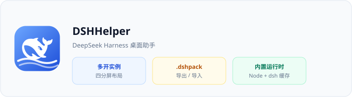
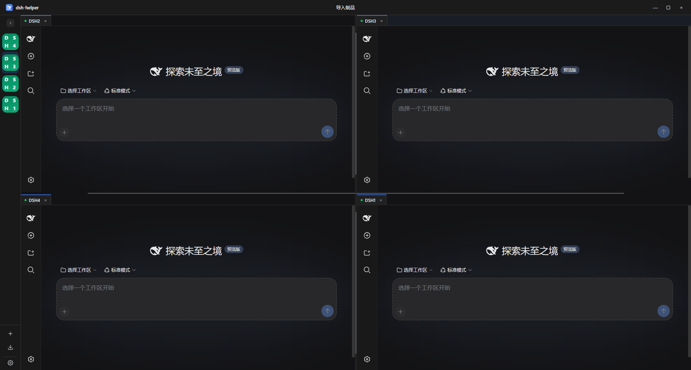

# DSHHelper — DeepSeek Harness 桌面助手

[English](README.md) · [用户指南 (ZH)](docs/user-guide.zh-CN.md) · [User Guide (EN)](docs/user-guide.en.md)

**DSHHelper** 是一款桌面应用，用于在同一台电脑上**多开、互不干扰**地运行多套 DeepSeek Harness（dsh）工作间。内置 Node.js + dsh 运行时，支持**四分屏窗格布局**，并可通过 **`.dshpack` 制品**导出、分发已配置好的环境。

> 本仓库仅提供**介绍文档与 Release 安装包**，不包含应用源代码。

## 下载

安装包发布在 **[GitHub Releases](https://github.com/x102201/deepseek-harness-helper/releases)**。

| 平台 | 文件名格式 |
|------|------------|
| Windows x64 | `DSHHelper_{version}_windows_x64-setup.exe` |
| Windows arm64 | `DSHHelper_{version}_windows_arm64-setup.exe` |
| macOS | `DSHHelper_{version}_macos_{arch}.dmg` |
| Linux | `DSHHelper_{version}_linux_{arch}.deb` · `.AppImage` |

版本号以安装包文件名为准，最新构建见 [Releases](https://github.com/x102201/deepseek-harness-helper/releases)。

## 核心能力

- **多开实例** — 多套 dsh 环境并行；拖拽标签可分屏为 2×2 四角布局
- **内置运行时** — Node + dsh 缓存于数据目录（Windows 默认 `%USERPROFILE%\.dshHelper`）
- **`.dshpack` 制品** — 打包预设、补丁与设置，支持机器码 / 密码等授权方式
- **浅色 / 深色外观** — 设置 → 通用 → 外观（仅影响助手壳界面，不影响实例内页面）

## 快速上手

1. 从 Releases 安装并启动 **DSHHelper**
2. 按首次引导完成：数据目录 → 运行环境 → 创建首个实例
3. 在侧栏新建更多实例；打开多个工作台并拖成四分屏

完整说明见 **[docs/user-guide.zh-CN.md](docs/user-guide.zh-CN.md)**

## 数据目录

环境、缓存、导入、设置与日志均位于同一数据根目录（默认用户目录下的 `.dshHelper`）。可在 **设置 → 通用** 中修改或迁移。

## 反馈

- [GitHub Issues](https://github.com/x102201/deepseek-harness-helper/issues)
- 应用内：**设置 → 关于 → 反馈**

## 许可与说明

安装包通过本仓库 Releases 分发。产品会匿名汇总使用情况以改进体验（时长与数量统计，不含路径与实例名称）。
