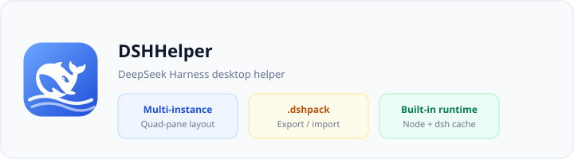
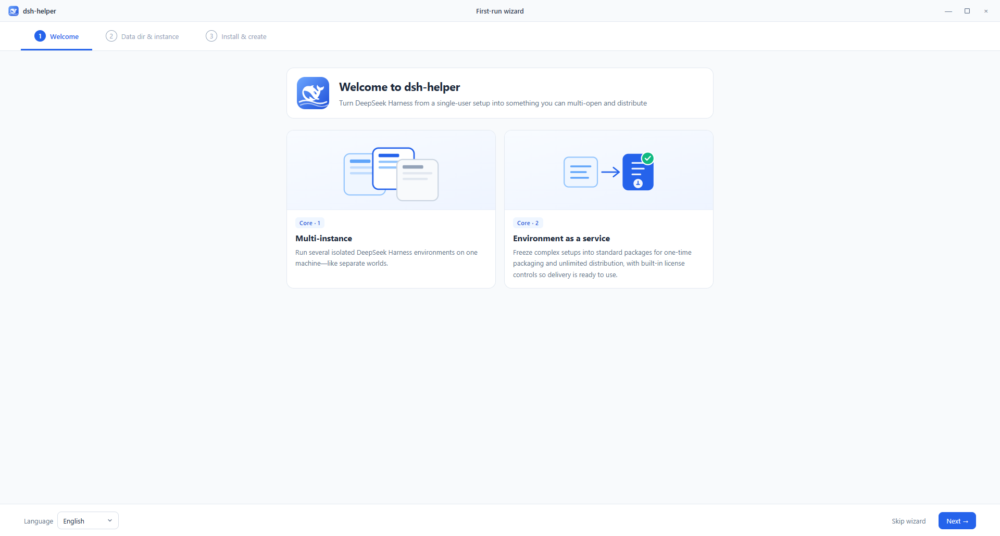
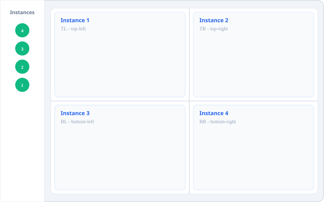
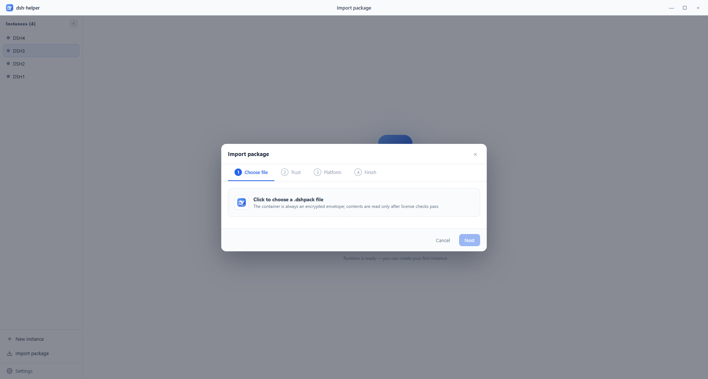

# DSHHelper User Guide

[中文](user-guide.zh-CN.md) · [Back to README](../README.md)

**DSHHelper** runs multiple **isolated** DeepSeek Harness (dsh) workspaces on one computer. It bundles Node.js and dsh, supports **quad-pane layouts**, and lets you ship configured environments as **`.dshpack`** packages.

> This guide is for end users. The public repository provides documentation and installers only — no source code.

## Contents

1. [Download & install](#download--install)
2. [First run](#first-run)
3. [Multi-instance & quad-pane](#multi-instance--quad-pane)
4. [Appearance (light / dark)](#appearance-light--dark)
5. [Packages (.dshpack)](#packages-dshpack)
6. [Data directory](#data-directory)
7. [FAQ](#faq)
8. [Feedback & privacy](#feedback--privacy)

---

## Download & install

Installers are on [GitHub Releases](https://github.com/x102201/deepseek-harness-helper/releases). Use the version embedded in the file name.

| Platform | Example file name |
|----------|-------------------|
| Windows x64 | `DSHHelper_0.1.1_windows_x64-setup.exe` |
| Windows arm64 | `DSHHelper_0.1.1_windows_arm64-setup.exe` |
| macOS | `DSHHelper_0.1.1_macos_arm64.dmg` |
| Linux | `DSHHelper_0.1.1_linux_amd64.deb` / `.AppImage` |

### Windows

1. Download the `-setup.exe` for your architecture
2. Run the installer
3. Launch **DSHHelper** from the Start menu or desktop shortcut

### macOS

1. Open the `.dmg` and drag **DSHHelper** into Applications
2. If Gatekeeper blocks the app: right-click → **Open**, or allow it under **System Settings → Privacy & Security**

> macOS builds are not notarized yet; this is expected.

### Linux

- **Debian / Ubuntu**: `sudo dpkg -i DSHHelper_*_linux_amd64.deb`
- **AppImage**: `chmod +x DSHHelper_*.AppImage`, then run it

---

## First run

On launch you’ll see the **first-run wizard**: welcome → data directory & instance name → download runtime and create the first instance.

*If the image is marked as an illustration, replace it with a real capture from your machine.*

The default **data directory** is `~/.dshHelper` (on Windows: `%USERPROFILE%\.dshHelper`). It stores instances, cache, imports, settings, and logs.

When the wizard finishes, your first instance appears in the sidebar. Double-click to open its workbench tab.

---

## Multi-instance & quad-pane

DSHHelper’s main value is **several dsh environments in one window**, each with its own process and data.

### Basics

1. Use **New instance** in the sidebar
2. Double-click an instance or drag it into the work area to open a tab
3. Drag a tab to a **window edge** to split panes; drop into another pane to **merge**
4. A common layout is **2×2 quad-pane**: four instances in the top-left, top-right, bottom-left, and bottom-right corners

Each instance runs its own DeepSeek Harness process. Startup phases are shown in the sidebar and workbench (process → dependencies → port ready).

---

## Appearance (light / dark)

Go to **Settings → General → Appearance**:

- **Light**
- **Dark**
- **Follow system**

This affects the **DSHHelper shell** (sidebar, tabs, settings) only — **not** the theme inside each instance’s DeepSeek Harness web UI.

---

## Packages (.dshpack)

A **`.dshpack`** file packages presets, patches, settings, and related configuration so you can distribute a ready-to-use workspace.

### Export

Open an instance’s **Details** page and choose **Export package**. Follow the wizard to set license mode (public, machine-bound, password, etc.).

### Import

Use **Import package** in the sidebar, pick a `.dshpack` file, and complete license checks and naming.

### Security

- Import packages from **trusted sources** only
- Password- or machine-bound exports are controlled by the publisher; losing license details may prevent import

You can associate `.dshpack` files with DSHHelper under **Settings → General**.

---

## Data directory

All user data lives under one folder:

- Instance environments
- Node / dsh runtime cache
- Import staging, logs, app settings

**Settings → General** shows the current path and lets you **Change…** or **Migrate…** to a new location. Do not force-quit the app during migration.

Uninstalling DSHHelper **does not remove** the data directory. Delete `.dshHelper` manually if you want a clean removal.

### System requirements (reference)

- Windows 10+
- macOS 11+
- Mainstream Linux (glibc)
- Disk: first runtime download depends on network; reserve several GB for cache and instances

---

## FAQ

**How does this relate to the official DeepSeek Harness CLI?**  
DSHHelper manages multiple local dsh runtimes and instances for desktop multi-instance and packaging; inside each tab you still use DeepSeek Harness.

**Why is the first start slow?**  
The first launch of a version installs dependencies inside the instance (often 1–3 minutes). Later starts are faster.

**macOS “unidentified developer” warning?**  
See the macOS install section — use right-click **Open** or allow in System Settings.

**Large Linux AppImage?**  
AppImages bundle dependencies; they are larger than `.deb` packages by design.

**Can I disable usage statistics?**  
The current build does not expose a toggle. Anonymous aggregates (duration, instance/package counts) are collected to improve the product — no paths or instance names.

---

## Feedback & privacy

- **Issues**: [GitHub Issues](https://github.com/x102201/deepseek-harness-helper/issues)
- **In-app**: Settings → About → Feedback

**Repository notice**: this public repo ships documentation and Release installers only, not application source code.
