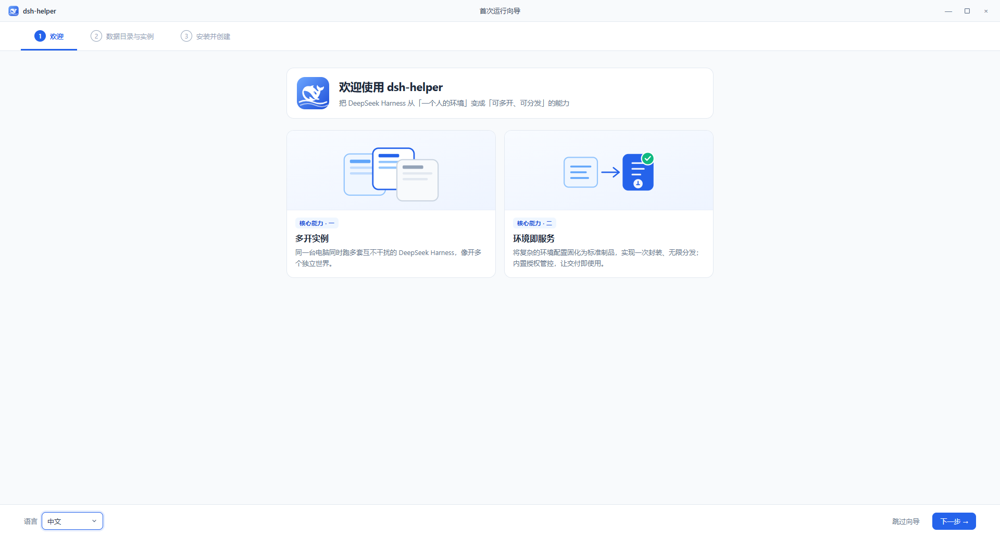
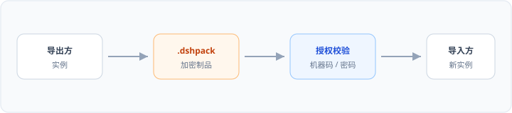
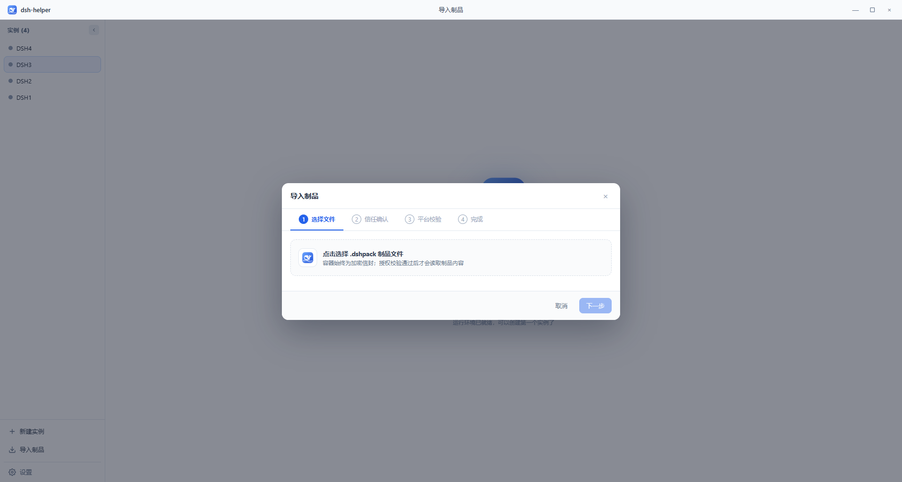

# DSHHelper 用户指南

[English](user-guide.en.md) · [返回首页](../README.zh-CN.md)

DSHHelper 帮助你在单台电脑上**多开、隔离**运行多套 DeepSeek Harness（dsh）工作间，内置 Node.js 与 dsh 运行时，并支持通过 **`.dshpack` 制品**打包与分发已配置好的环境。

> 本指南面向终端用户。公开仓库仅提供文档与安装包，不含源代码。

## 目录

1. [下载与安装](#下载与安装)
2. [首次使用](#首次使用)
3. [多开与四分屏](#多开与四分屏)
4. [外观（浅色 / 深色）](#外观浅色--深色)
5. [制品（.dshpack）](#制品dshpack)
6. [数据目录与迁移](#数据目录与迁移)
7. [常见问题](#常见问题)
8. [反馈与隐私](#反馈与隐私)

---

## 下载与安装

安装包发布在 [GitHub Releases](https://github.com/x102201/deepseek-harness-helper/releases)。版本号以安装包文件名为准。

| 平台 | 文件名示例 |
|------|------------|
| Windows x64 | `DSHHelper_0.1.1_windows_x64-setup.exe` |
| Windows arm64 | `DSHHelper_0.1.1_windows_arm64-setup.exe` |
| macOS | `DSHHelper_0.1.1_macos_arm64.dmg` |
| Linux | `DSHHelper_0.1.1_linux_amd64.deb` / `.AppImage` |

### Windows

1. 从 Releases 下载对应架构的 `-setup.exe`
2. 双击运行安装向导，按提示完成
3. 从开始菜单或桌面快捷方式启动 **DSHHelper**

### macOS

1. 下载 `.dmg` 并打开
2. 将 **DSHHelper** 拖入「应用程序」
3. 首次打开若被 Gatekeeper 拦截：在 Finder 中右键应用 → **打开**，或在「系统设置 → 隐私与安全性」中允许

> 当前 macOS 安装包未经 Apple 公证，属预期行为。

### Linux

- **Debian / Ubuntu**：`sudo dpkg -i DSHHelper_*_linux_amd64.deb`（arm64 同理）
- **AppImage**：`chmod +x DSHHelper_*.AppImage` 后双击或命令行运行

---

## 首次使用

启动后会进入**首次运行向导**，依次完成：欢迎说明 → 数据目录与实例命名 → 下载运行环境并创建首个实例。

*若图为示意图，请以你本机界面为准。*

**数据目录**默认位于用户目录下的 `.dshHelper`（Windows 为 `%USERPROFILE%\.dshHelper`），用于存放全部实例、缓存、导入文件、设置与日志。

向导结束后，侧栏会出现你的第一个实例；双击可打开工作台。

---

## 多开与四分屏

DSHHelper 的核心能力是**同一窗口内并行运行多个实例**，互不共享进程与数据目录。

### 基本操作

1. 侧栏点击 **新建实例** 创建更多环境
2. 双击实例名，或把侧栏项拖入工作区，打开对应标签
3. 将标签拖到窗口**边缘**可分割窗格；拖入另一窗格可**合并**
4. 典型布局为 **2×2 四分屏**：四个实例分别位于左上、右上、左下、右下

每个实例拥有独立的 DeepSeek Harness 进程与端口；启动过程可在侧栏或工作台内查看阶段（启动进程 → 初始化运行环境 → 等待端口就绪）。

---

## 外观（浅色 / 深色）

在 **设置 → 通用 → 外观** 中选择：

- **浅色**
- **深色**
- **跟随系统**

外观仅影响 **DSHHelper 壳界面**（侧栏、标签栏、设置页等），**不会**改变各实例内 DeepSeek Harness 网页的主题。

建议在同一四分屏布局下分别截取浅色与深色主题，便于对比（见上文两张主界面图）。

---

## 制品（.dshpack）

`.dshpack` 是 DSHHelper 的**环境制品**格式，用于打包预设、补丁、设置等，便于在团队或客户间分发「配好的」工作间。

### 导出

在实例 **详情** 页选择 **导出制品**，按向导设置授权方式（如公开、机器码、密码等）与导出范围。

### 导入

侧栏 **导入制品**，选择 `.dshpack` 文件并按提示完成授权校验与实例命名。

### 安全提示

- 仅导入**可信来源**的制品
- 带密码或机器码绑定的包由导出方控制使用范围；丢失授权信息可能无法导入

可在 **设置 → 通用** 中关联 `.dshpack` 文件类型，便于双击打开导入流程。

---

## 数据目录与迁移

所有用户数据集中在**一个根目录**下，包括：

- 各实例的环境与配置
- Node / dsh 运行时缓存
- 导入暂存、日志、应用设置

在 **设置 → 通用** 可查看当前路径，并使用 **更改…** / **迁移…** 移动到新位置（迁移时请勿强制结束应用）。

卸载 DSHHelper **不会自动删除**数据目录；若需彻底清理，请在卸载后手动删除 `.dshHelper` 文件夹。

### 系统要求（参考）

- Windows 10 及以上
- macOS 11 及以上
- 主流 Linux（glibc）
- 磁盘：首次下载运行时视网络情况而定；建议预留数 GB 用于缓存与实例

---

## 常见问题

**与官方 DeepSeek Harness CLI 是什么关系？**  
DSHHelper 在本地管理多套 dsh 运行时与实例，面向桌面多开与制品分发；实例内仍是官方 DeepSeek Harness 体验。

**实例启动很慢？**  
首次启动某版本时会在实例目录内安装依赖，通常需要 1–3 分钟；后续启动会快很多。

**macOS 提示无法验证开发者？**  
见上文 macOS 安装说明，使用右键「打开」或系统设置放行。

**Linux AppImage 很大？**  
AppImage 自带依赖，体积大于 `.deb` 属正常现象。

**可以关闭使用统计吗？**  
当前版本在设置中不显示开关，产品会匿名汇总使用时长与实例/制品数量，用于改进体验，不包含路径、实例名称等可识别内容。

---

## 反馈与隐私

- **问题反馈**：[GitHub Issues](https://github.com/x102201/deepseek-harness-helper/issues)
- **应用内**：设置 → 关于 → 反馈

**许可与仓库说明**：本公开仓库仅分发文档与 Release 安装包，不包含应用源代码。安装与使用须遵守 Releases 页及导出制品附带的相关说明。
